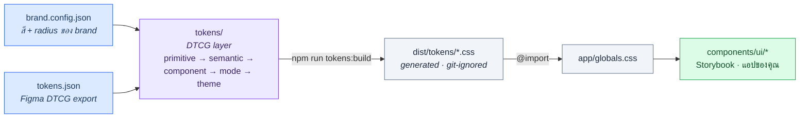

<div align="center">

# @npsin-oreo/design-system

**Design system แบบ white-label สำหรับ React 19 · Next.js 15 · Tailwind CSS v4**
สีและ radius มาจากไฟล์เดียว · component ดึงสีจาก semantic token เท่านั้น · แต่ละ brand อยู่บน branch ของตัวเอง

[](./package.json)
[](https://npsin-oreo.github.io/looloo-design-system/)
[](https://nextjs.org/)
[](https://react.dev/)
[](https://tailwindcss.com/)

📖 **[Storybook — เอกสาร component สด (70+ ตัว)](https://npsin-oreo.github.io/looloo-design-system/)**

</div>

---

## สารบัญ

- [repo นี้ทำงานยังไง](#repo-นี้ทำงานยังไง) — ภาพเดียวจบ
- [แนวคิดหลัก 5 ข้อ](#แนวคิดหลัก-5-ข้อ)
- [Token pipeline](#token-pipeline) — สีเดินทางจากไฟล์เดียวไปถึง component ยังไง
- [แผนผังโปรเจกต์](#แผนผังโปรเจกต์)
- [คำสั่งที่ใช้บ่อย](#คำสั่งที่ใช้บ่อย)
- [ใช้งานเป็น Consumer](#ใช้งานเป็น-consumer) — quick start
- [ทำ theme ต่อ brand](#ทำ-theme-ต่อ-brand)
- [Quality gates & CI](#quality-gates--ci)
- [เอกสารเพิ่มเติม](#เอกสารเพิ่มเติม)

---

## repo นี้ทำงานยังไง

หัวใจมีประโยคเดียว: **แก้สีที่ไฟล์ต้นทางไฟล์เดียว → รันสคริปต์ → CSS ทั้งชุด regenerate เอง** ไม่มีใครไปแก้สีใน component หรือใน `:root` ด้วยมือ



**base เป็น neutral white-label** — repo หลัก (branch `main`) ไม่มีสี brand ของใครโดยเฉพาะ แต่ละ brand จริงไปอยู่บน branch ของตัวเอง (เช่น `brand/virtual-agent`) โดยแก้แค่ไฟล์ต้นทาง 2 ไฟล์แล้ว regenerate ทับ — structure, component, และ gate ทั้งหมด inherit มาจาก `main`

---

## แนวคิดหลัก 5 ข้อ

| # | หลักการ | หมายความว่า |
|---|---|---|
| 1 | **White-label base** | `main` เป็นฐานกลาง ไม่มีสี brand · brand = branch |
| 2 | **ต้นทางเดียว** | สี/radius อยู่ใน `brand.config.json` เท่านั้น — ห้ามแก้ CSS ที่ generate |
| 3 | **Semantic token only** | component ใช้ `bg-primary`, `text-muted-foreground` — ห้าม `bg-white` / `bg-[#123]` |
| 4 | **Folder-per-component** | ทุก component อยู่ใน `components/ui/<name>/` มี token file ของตัวเอง |
| 5 | **Contracts & gates** | ไฟล์ contract generate อัตโนมัติ + audit ที่ block CI ถ้า drift หรือ contrast ไม่ผ่าน |

---

## Token pipeline

Token เป็นชั้น ไล่จาก "ค่าดิบ" ไปหา "ความหมาย" ตามมาตรฐาน [DTCG](https://tr.designtokens.org/) — ชั้นล่างไม่รู้จัก brand ชั้นบนสุดคือสิ่งที่ component เห็น

| ชั้น | ที่อยู่ | หน้าที่ |
|---|---|---|
| **primitive** | `tokens/primitive/` | ค่าดิบ — สี ramp, ระยะ, radius (`--ll-*`) |
| **semantic** | `tokens/semantic/` | ความหมาย — `--background`, `--primary`, `--border` (ชื่อ shadcn) |
| **component** | `tokens/component/` | ต่อ component — 65 ไฟล์ เช่น `--alert-color-*`, `--sidebar-*` |
| **mode** | `tokens/mode/` | dark mode override |
| **theme** | `tokens/theme/` | ชุด theme สำเร็จ |

สคริปต์ที่ประกอบทุกอย่างเข้าด้วยกัน (predev/prebuild hook รันให้อัตโนมัติ):

```bash
npm run brand:build      # brand.config.json → app/brand.css (legacy contract)
npm run tokens:migrate   # brand.config + tokens.json → tokens/{primitive,semantic,mode,theme}
npm run tokens:build     # tokens/ → dist/tokens/*.css (+ .ts + contract)
npm run tokens:validate  # โครงสร้าง token ถูกต้อง · ทุก ref resolve
npm run tokens:diff      # dist ตรงกับ legacy CSS (parity gate ที่ CI บังคับ)
npm run tokens:audit     # contrast ทุกคู่ผ่าน WCAG AA
```

> 📌 `dist/tokens/` ถูก git-ignore — regenerate จาก source เสมอ อย่าแก้ด้วยมือ
> รายละเอียดว่าไฟล์ไหน generate ไฟล์ไหนแก้มือได้ อยู่ใน [`tokens/README.md`](./tokens/README.md)

---

## แผนผังโปรเจกต์

```
looloo-design-system/
├── brand.config.json         ← 🎨 สี + radius ของ brand (ต้นทางเดียว)
├── tokens.json               ← Figma DTCG export (brand ramp เริ่มต้น)
│
├── tokens/                   ← canonical DTCG layer (primitive→semantic→component→mode→theme)
├── scripts/                  ← สคริปต์ build / validate / audit / migrate
├── dist/tokens/              ← CSS ที่ generate (git-ignored)
│
├── app/
│   ├── globals.css           ← @import dist/tokens/*.css + @theme structural
│   ├── brand.css             ← legacy brand contract (สำหรับ consumer เดิม)
│   └── primitives.css        ← legacy primitive contract
│
├── components/ui/<name>/     ← 70+ component · folder-per-component
├── icons/icon-registry.ts    ← ทางเข้า lucide ทางเดียว (<Icon> / <IconButton>)
├── stories/                  ← Storybook (render + a11y ใน CI)
│
├── .designops/               ← contract ที่ generate + audit gates
└── .storybook/               ← Storybook config
```

---

## คำสั่งที่ใช้บ่อย

| คำสั่ง | ทำอะไร |
|---|---|
| `npm run dev` | รัน Next.js dev server |
| `npm run storybook` | รัน Storybook ที่ port 6006 |
| `npm run check` | ✅ gate ครบชุดในเครื่อง — typecheck + token validate/build/diff + audit (styles/icons/contrast) แบบ `--strict` |
| `npm run tokens:build` | regenerate `dist/tokens/*.css` จาก `tokens/` |
| `npm run brand:build` | regenerate brand CSS จาก `brand.config.json` |
| `npm run build` | build production ของแอป |

**เปลี่ยนสี brand:** แก้ `brand.config.json` → `npm run brand:build && npm run tokens:migrate && npm run tokens:build` (อย่าแก้ CSS ที่ generate เอง)

---

## ใช้งานเป็น Consumer

### 1. ติดตั้ง

```bash
npm install git+ssh://git@github.com/npsin-oreo/looloo-design-system.git#v0.12.0
```

> แนะนำ pin ด้วย tag (`#v0.12.0`) หรือ commit sha เพื่อให้ทุกเครื่องได้ source ชุดเดียวกัน · ต้องตั้ง SSH key กับ GitHub แล้ว (ทดสอบ: `ssh -T git@github.com`)

### 2. ตั้งค่า Next.js

แพ็กเกจส่ง component เป็น TypeScript source — เพิ่ม `transpilePackages`:

```ts
// next.config.ts
const nextConfig = { transpilePackages: ["@npsin-oreo/design-system"] }
export default nextConfig
```

### 3. โหลด style ครั้งเดียวที่ root

```tsx
// app/layout.tsx
import "@npsin-oreo/design-system/styles.css"
```

ไฟล์นี้รวม Tailwind, animation utilities, primitive + brand tokens และ base styles ครบแล้ว

### 4. เรียก component

```tsx
import { Button } from "@npsin-oreo/design-system/button"
import { Card, CardHeader, CardTitle, CardContent } from "@npsin-oreo/design-system/card"

export function Example() {
  return (
    <Card className="max-w-md">
      <CardHeader>
        <CardTitle>สร้างโปรเจกต์ใหม่</CardTitle>
      </CardHeader>
      <CardContent>
        <Button>เริ่มต้น</Button>
      </CardContent>
    </Card>
  )
}
```

### 5. ใช้สีแบบ semantic เสมอ

เพื่อให้สีเปลี่ยนตาม brand และ dark mode อัตโนมัติ — **ห้าม** `bg-white` / `text-black` / `bg-[#123456]` ใน component ทั่วไป

| หน้าที่ | Background | Text |
|---|---|---|
| หน้าหลัก | `bg-background` | `text-foreground` |
| Card | `bg-card` | `text-card-foreground` |
| Action หลัก | `bg-primary` | `text-primary-foreground` |
| Action รอง | `bg-secondary` | `text-secondary-foreground` |
| ข้อมูลรอง | `bg-muted` | `text-muted-foreground` |
| Hover / selected | `bg-accent` | `text-accent-foreground` |
| Error | `bg-destructive` | `text-destructive` |
| เส้นขอบ · Focus | `border-border` | `ring-ring` |

Dark mode: ใส่ class `dark` ที่ `<html>` แล้วสีหลัก flip เอง ไม่ต้องเขียน `dark:` ซ้ำ · จะใช้ `ThemeProvider` (จาก `next-themes`) ที่แพ็กเกจ export ไว้ก็ได้

---

## ทำ theme ต่อ brand

ค่าเริ่มต้นเป็น neutral white-label — override สี brand ได้โดย **ไม่ต้อง fork**:

```bash
# เขียน brand.config.json (รับทั้ง flat และ nested) แล้ว build
npx ds-brand-build          # → ./app/brand.css (alias เข้า primitive + derive *-foreground ให้)
```

```ts
import "@npsin-oreo/design-system/styles.css"
import "./app/brand.css"     // โหลดทับให้ :root override ชนะ
```

รายชื่อ token ที่ theme ได้อยู่ใน [`token-contract.json`](./token-contract.json) · วิธี + ตัวอย่างเต็มดู [`THEMING.md`](./THEMING.md)

---

## Quality gates & CI

ทุก PR ต้องผ่าน gate เหล่านี้ (รันในเครื่องได้ด้วย `npm run check`):

| Gate | ตรวจอะไร |
|---|---|
| **Typecheck** | `tsc --noEmit` |
| **Token reproducibility** | ไฟล์ generate ตรงกับ source (ถ้า drift = แดง) |
| **Token diff (parity)** | `dist/tokens` ให้ค่าเท่า legacy CSS |
| **Contrast audit** | ทุกคู่สีผ่าน WCAG AA |
| **Storybook tests** | ทุก story render ได้ + axe a11y ผ่าน |

Storybook deploy ขึ้น GitHub Pages อัตโนมัติทุกครั้งที่ push เข้า `main` · package publish ขึ้น GitHub Packages เมื่อ push tag `v*`

---

## เอกสารเพิ่มเติม

| เอกสาร | เนื้อหา |
|---|---|
| [`DESIGN.md`](./DESIGN.md) | สเปก design system |
| [`DEVELOPMENT.md`](./DEVELOPMENT.md) | เพิ่ม component · แก้ token · release |
| [`THEMING.md`](./THEMING.md) | ทำ theme ต่อ brand แบบละเอียด |
| [`tokens/README.md`](./tokens/README.md) | ตารางไฟล์ generate vs แก้มือ |
| [`docs/tokens/token-source-strategy.md`](./docs/tokens/token-source-strategy.md) | ที่มาของ token layer |
| [`docs/component-guidelines.md`](./docs/component-guidelines.md) | แนวทางเขียน component |
| [`docs/icon-strategy.md`](./docs/icon-strategy.md) | ระบบ icon (registry เดียว) |
| [`.designops/README.md`](./.designops/README.md) · [`.designops/audit-gates.md`](./.designops/audit-gates.md) | contract + gate |
